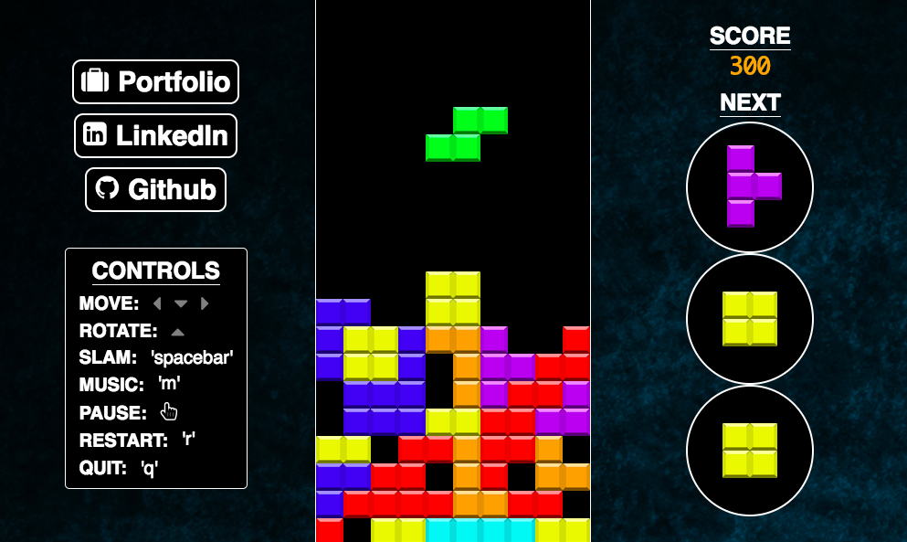

# Tetris
[Live](http://www.jamaya.me/tetris)


The classic arcade game!

## Instructions
Complete rows with the falling blocks to score points! Clear under 4 rows and score 100 points each. Clear 4 rows (aka Tetris) and score 800 points. Get a back-to-back Tetris and score 1200 points!

## Technologies
- JavaScript
- HTML5 Canvas
- Easel.js

### Cascading Blocks
Cascading blocks were created using JavaScript promises. Clear the white blocks, then move each block down one by one.

```JavaScript
clearWhiteBlocks(whiteBlocks, cascade) {
  cascade = cascade.then(() => {
    return new Promise((resolve) => {
      setTimeout(() => {
        for (let i = 0; i < whiteBlocks.length; i++) {
          stage.removeChild(whiteBlocks[i]);
        }
        stage.update();
        resolve();
      }, 100)
    })
  })
}

moveEverythingDown(clearedRow, cascade) {
  for (let i = clearedRow - 1; i >= 0; i--) {
    for (let j = 0; j < 10; j++) {
      if (this.grid[i][j]) {
        const block = this.grid[i][j];

        cascade = cascade.then(() => {
          return new Promise((resolve) => {
            setTimeout(() => {
              block.y += BLOCK_WIDTH;
              stage.update();
              resolve();
            }, 50)
          })
        })

        this.grid[i+1][j] = this.grid[i][j];
        this.grid[i][j] = false;
      }
    }
  }
}
```

The same promise is passed to `clearWhiteBlocks` and `moveEverythingDown` in order for the `setTimeout` methods to to happen synchronously.

### Increasing Difficulty
The difficulty increases with your score. Every 250 points, the falling speed increases by 48 milliseconds. The falling speed caps at a healthy rate of 1 block/ 120 milliseconds.

```JavaScript
const level = this.currentScore / 250;

if (level < 11) {
  this.currentSpeed = 600 - level * 48;
}
```

## Future Features
- [ ] Embed bombs into blocks
- [ ] Multiplayer
