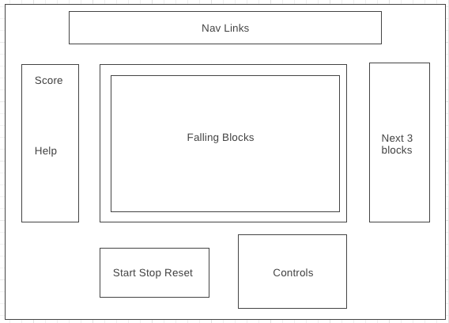
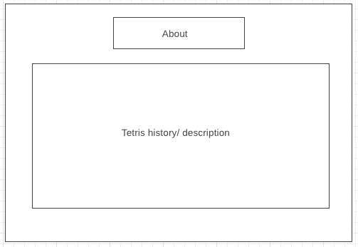

## Tetris

### Background

Tetris is the classic tile-matching puzzle game. Score points by forming lines across the screen.

### Functionality & MVP  

With this version of Tetris, users can:

- [ ] Start, pause, and reset the game
- [ ] Move blocks left and right
- [ ] Increase block fall speed
- [ ] Rotate the falling block clockwise
- [ ] Listen to the classic Tetris tune

In addition, this project will include:

- [ ] An About modal describing the background and rules of the game
- [ ] A production README

### Wireframes

This app will consist of a single game screen, with nav links to the Github repo, my LinkedIn, and the About modal. Game controls will include Start, Stop, and Reset buttons as well as Left and Right buttons to postiion the falling block, Down button to increase the fall speed, and a Rotate button to rotate the falling block. On the left, there will be a display that shows the score and how to use the controls. On the right, there will be a list of the next 3 falling blocks.  Additionally, users can control the falling blocks with arrow keys on the keyboard.

#### Main wireframe

#### About Modal wireframe

### Architecture and Technologies

This project will be implemented with the following technologies:

- `JavaScript` for game logic
- `three.js` with `HTML5 Canvas` for effects rendering
- `Webpack` to bundle js files

The main files will include:

- `board.js` which will handle the drawing and rendering of shapes
- `block.js` which will handle the logic for the blocks, including size, shape, speed
- `row.js` which will keep track of how many cells are filled in by blocks
- `game.js` which will handle the logic of connecting blocks with rows

### Implementation Timeline

**Day 1**: Learn all about HTML5 Canvas and three.js. Goal for the day:
- Be able to have an outline of where drawn objects will go.

**Day 2**: Continue learning about HTML5 Canvas and three.js. Goal for the day:
- Be able to draw shapes at will and with ease.

**Day 3**: Create the tetris logic backend. Start with `block.js` since it's the building blocks for the other logic. Goals for the day:
- Be able to connect `block.js`, `row.js` and `game.js`
- Begin tying logic to rendering

**Day 4**: Install the controls for the user to interact with the game.  Style the frontend, making it polished and professional.  Goals for the day:

- Create controls for game speed, stop, start, reset, and moving the blocks
- Have a styled game screen, nice looking controls and title

### Bonus features

I will continue working on this project and implementing the following features:

- [ ] Embed bombs into blocks
- [ ] Multiplayer
